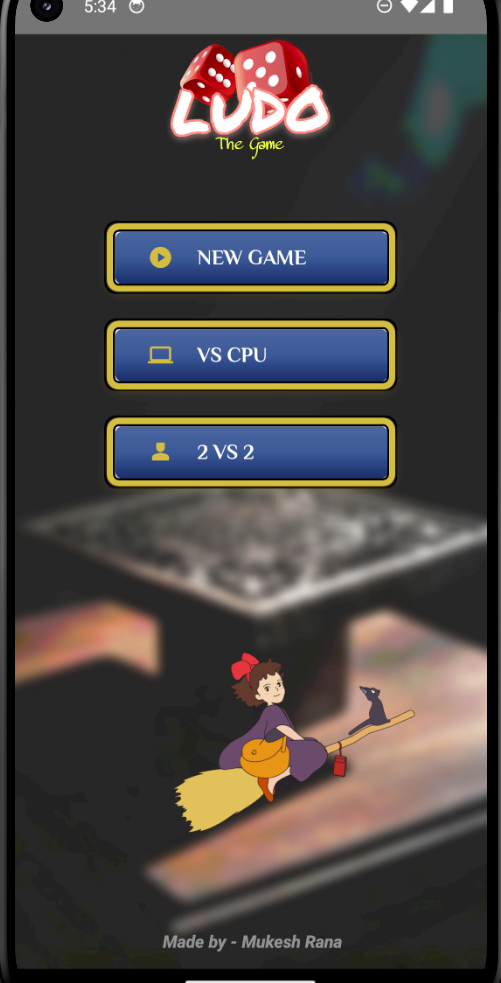
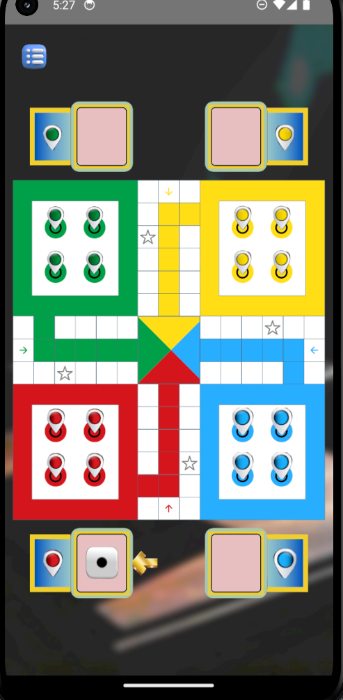
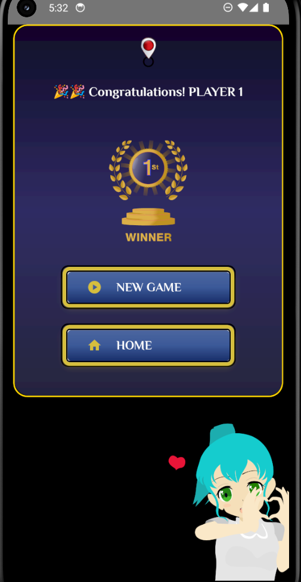

# Ludo Game - React Native

A multiplayer Ludo game developed using React Native and Redux Toolkit. The project implements complete Ludo gameplay mechanics including dice rolling, piece movement, turn management, collision handling, winner detection, animations, and sound effects.

## Features

* Multiplayer Ludo gameplay
* Dice roll animation
* Piece movement system
* Turn-based game logic
* Piece collision and elimination
* Winner detection
* Sound effects
* Animated UI using Lottie
* Redux Toolkit state management
* SVG-based selection indicators

## Tech Stack

* React Native
* JavaScript
* Redux Toolkit
* Redux Persist
* React Native SVG
* Lottie React Native

## Project Structure

src/
├── components/
├── screens/
├── redux/
├── navigation/
├── helpers/
├── constants/
└── assets/

## Installation

1. Clone the repository

git clone https://github.com/Mukeshrana45/ludo-game.git

2. Install dependencies

npm install

3. Run Android application

npx react-native run-android

## Screenshots

### Home Screen

### Game Board

### Winner Screen

## Future Improvements

* Single-player mode against CPU
* Online multiplayer support
* Improved winner area rendering
* Enhanced animations
* Game statistics and leaderboard

## Author

Mukesh Rana
NIT Trichy
